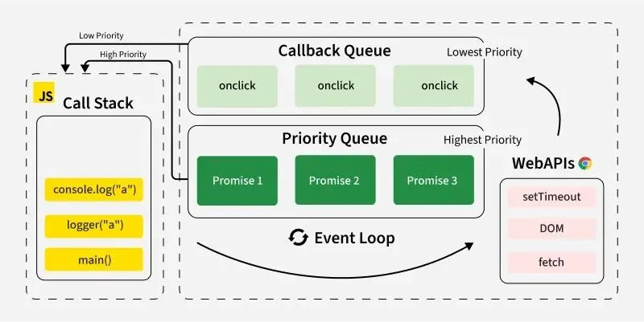
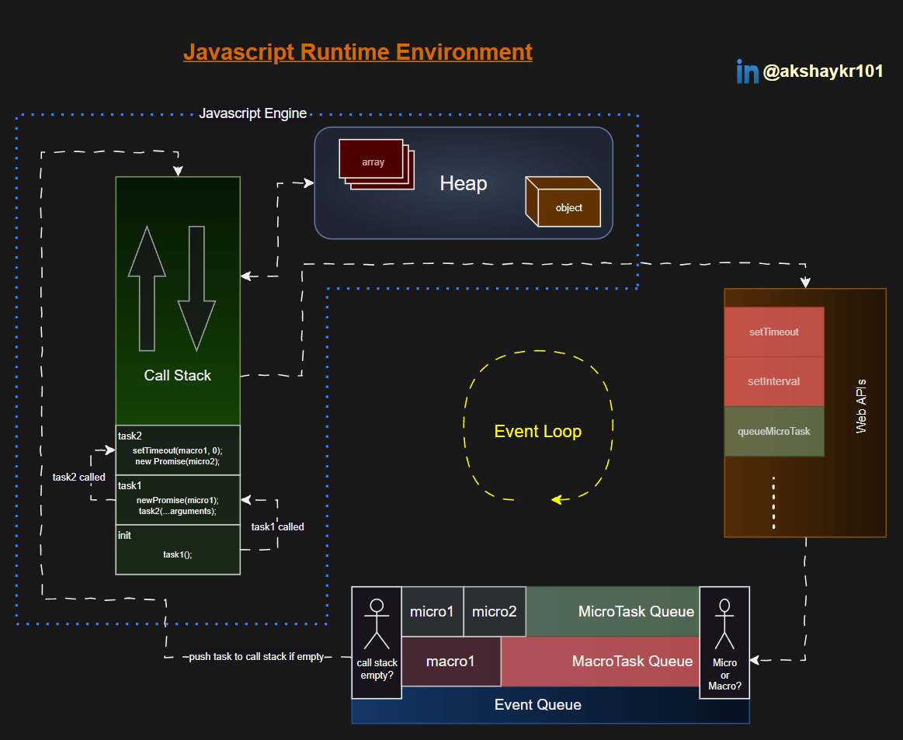

# Event Loop



## Event loop Mechanism 
- Event loop is a machanism of Javascript which handles execution order of code which includes both synchronous & asynchronous tasks in order without blocking the callstack.

### Event Loop Execution order Priority
 1) Execute all sync code in call stack.
 2) When call stack is empty:
    1) Pick and run ALL microtasks
 3) After microtasks are cleared:
    1) Pick ONE macrotask from the task queue.
 4) Repeat

### Microtasks
- Microtasks are high priority tasks and are executed immediately after the current call stack is empty and before any macrotasks.
- `Promise.then`, `Promise.catch`, `Promise.finally` 
- `queueMicrotask`
- `MutationObserver`

```js

console.log("Start");

Promise.resolve().then(() => {
  console.log("Microtask");
});

console.log("End");

// OUTPUT : 

// Start
// End
// Microtask

```

### Macrotasks 
- Macrotasks are lower priority than microtasks and are executed after all microtasks are completed.
- `setTimeout`, `setInterval`
-  `requestAnimationFrame`
-  UI Events (click, input, etc.)
  
```js
console.log("Start");

setTimeout(() => {
  console.log("Macrotask");
}, 0);

console.log("End");

// OUTPUT : 

// Start
// End
// Macrotask

```

### Combined Example
```js
console.log("1");

setTimeout(() => {
  console.log("2");
}, 0);

Promise.resolve().then(() => {
  console.log("3");
});

console.log("4");

// 1 4 3 2
```

## JavaScript Runtime Architecture
1) Call Stack – Executes the code.
2) Heap – Memory allocation.
3) Web APIs (Browser only) – setTimeout, DOM events, fetch, etc.
4) Callback/Task Queues:
   1) Microtask Queue
   2) Macrotask (Task) Queue
5) Event Loop – Continuously checks if the Call Stack is empty and picks tasks from queues.



## OUTPUT BASED QUESIONS

### 🔥 Level 1: Basics

<details>
  <summary>
<pre>

   ```javascript
  console.log("A");

setTimeout(() => console.log("B"), 0);

Promise.resolve().then(() => console.log("C"));

console.log("D");
```
</pre>
  </summary>

```javascript
A  
D  
C  
B

```
</details>


<details>
  <summary>
<pre>

   ```javascript
setTimeout(() => console.log("1"), 0);

Promise.resolve().then(() => console.log("2"));

queueMicrotask(() => console.log("3"));

console.log("4");

```
</pre>
  </summary>

```javascript
4 
2
3
1

```
</details>


<details>
  <summary>
<pre>

   ```javascript
setTimeout(() => {
  console.log("A");
  Promise.resolve().then(() => console.log("B"));
}, 0);

Promise.resolve().then(() => console.log("C"));

console.log("D");


```
</pre>
  </summary>

```javascript
D  
C  
A  
B


```
</details>

<details>
  <summary>
<pre>

   ```javascript
console.log("1");

setTimeout(() => {
  console.log("2");
}, 0);

setTimeout(() => {
  console.log("3");
}, 0);

Promise.resolve().then(() => {
  console.log("4");
});

console.log("5");


```
</pre>
  </summary>

```javascript
1  
5  
4  
2  
3

```
</details>


<details>
  <summary>
<pre>

   ```javascript
Promise.resolve().then(() => {
  console.log("A");
  Promise.resolve().then(() => console.log("B"));
});

console.log("C");

```
</pre>
  </summary>

```javascript
C 
A 
B

```
</details>


<details>
  <summary>
<pre>

   ```javascript
setTimeout(() => console.log("A"), 0);

Promise.resolve().then(() => {
  console.log("B");
  setTimeout(() => console.log("C"), 0);
});

console.log("D");


```
</pre>
  </summary>

```javascript
D  
B  
A  
C


```
</details>


<details>
  <summary>
<pre>

   ```javascript
queueMicrotask(() => {
  console.log("X");
  queueMicrotask(() => {
    console.log("Y");
  });
});

console.log("Z");

```
</pre>
  </summary>

```javascript
Z  
X  
Y
```
</details>

