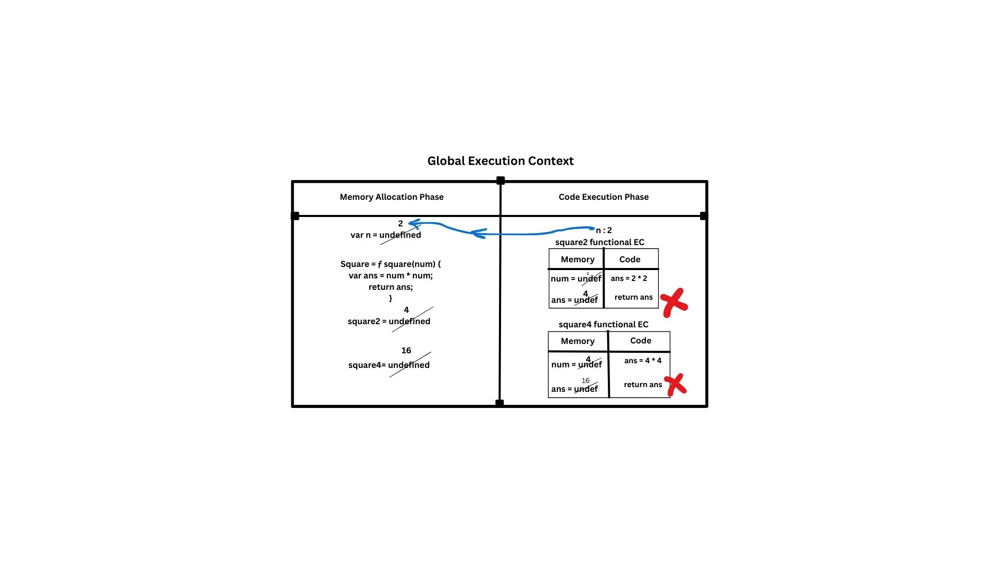
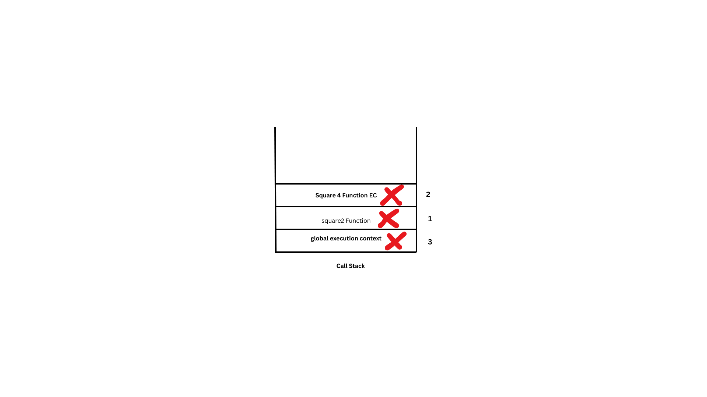

# Execution Context

- Javascript is a synchronous single threaded language
- Everything in javascript happens inside an execution context.
- It has mainly 2 components 
    - Memory Component
    - Code Component 
- Memeory Component : It is the place where all the variable & functions stored as key value pairs.It is also know as **variable environment** or **Content creation Phase**.
- Code Component : It is the place all the code executed line by line( one line at a time ), It is also known as **Thread of Execution**.

### Example

```js
console.log( n );
console.log( square2 );
console.log( square4 );

var n = 2;
function square ( num ) {
    var ans = num * num;
    return ans;
}
var square2 = square( n );
var square4 = square( 4 );

```

**Execution Step by step**
 1. Whenever JS starts running program it creates global execution context, It has 2 phases. <br />
    **Memory creation phase**
    1. Memory creation phase where JS skims through the whole program or file then it allocates memory for variables & functions.
    2. For variables it initially stores `undefined`, for functions it stores whole function.

    **Code execution Phase**
    1. Here js start run the code line by line & evalute the code then it initialize the values to the variables.


### How Exactly JS runs & check twice the code 
```
📜 1. JS Code (your source file)
      ↓
🧠 2. Parsing (Syntax Analysis)
   ✅ Checks for syntax errors
   ✅ Converts code into → AST (Abstract Syntax Tree)
      ↓
🌳 3. AST (Abstract Syntax Tree) is created
   - A structured tree representing your code
   - JS Engine **does not execute anything yet**
      ↓
⚙️ 4. Creation Phase (Execution Context is prepared)
   🔁 JS walks the AST – **1st time**
   ✅ Memory is allocated:
      - `var` → gets `undefined`
      - `function` → full function object
   ❌ No actual execution happens yet
      ↓
🚀 5. Execution Phase
   🔁 JS walks the AST – **2nd time**
   ✅ Code is executed top-to-bottom
   ✅ Variables get actual values
   ✅ Functions get called
      ↓
📤 6. Output is printed (e.g., via `console.log`)

```

**Summary** 
```
Code 
 → Parse 
   → AST 
     → (Walk 1) Memory Allocation 
     → (Walk 2) Code Execution 
       → Output

```

## We will go through this flow step by step 

**STEP 1 JS Code (your source file)**
```js

console.log( n );
console.log( square2 );
console.log( square4 );

var n = 2;
function square ( num ) {
    var ans = num * num;
    return ans;
}
var square2 = square( n );
var square4 = square( 4 );

```
<a id="step-2"></a>
**STEP 2 Parsing & convert to AST (Abstract Syntax Tree)**
- [Feel free to skip this step and move to Step 3](#step-3)
- After creating of AST our code looks like this 
- 🔍 [AST Explorer](https://astexplorer.net/) – Visualize JavaScript's AST in real-time ( paste your js code left side )


```js
{
  "type": "Program",
  "start": 0,
  "end": 193,
  "body": [
    {
      "type": "ExpressionStatement",
      "start": 0,
      "end": 14,
      "expression": {
        "type": "CallExpression",
        "start": 0,
        "end": 14,
        "callee": {
          "type": "MemberExpression",
          "start": 0,
          "end": 11,
          "object": {
            "type": "Identifier",
            "start": 0,
            "end": 7,
            "name": "console"
          },
          "property": {
            "type": "Identifier",
            "start": 8,
            "end": 11,
            "name": "log"
          },
          "computed": false,
          "optional": false
        },
        "arguments": [
          {
            "type": "Identifier",
            "start": 12,
            "end": 13,
            "name": "n"
          }
        ],
        "optional": false
      }
    },
    {
      "type": "ExpressionStatement",
      "start": 15,
      "end": 36,
      "expression": {
        "type": "CallExpression",
        "start": 15,
        "end": 35,
        "callee": {
          "type": "MemberExpression",
          "start": 15,
          "end": 26,
          "object": {
            "type": "Identifier",
            "start": 15,
            "end": 22,
            "name": "console"
          },
          "property": {
            "type": "Identifier",
            "start": 23,
            "end": 26,
            "name": "log"
          },
          "computed": false,
          "optional": false
        },
        "arguments": [
          {
            "type": "Identifier",
            "start": 27,
            "end": 34,
            "name": "square2"
          }
        ],
        "optional": false
      }
    },
    {
      "type": "ExpressionStatement",
      "start": 37,
      "end": 58,
      "expression": {
        "type": "CallExpression",
        "start": 37,
        "end": 57,
        "callee": {
          "type": "MemberExpression",
          "start": 37,
          "end": 48,
          "object": {
            "type": "Identifier",
            "start": 37,
            "end": 44,
            "name": "console"
          },
          "property": {
            "type": "Identifier",
            "start": 45,
            "end": 48,
            "name": "log"
          },
          "computed": false,
          "optional": false
        },
        "arguments": [
          {
            "type": "Identifier",
            "start": 49,
            "end": 56,
            "name": "square4"
          }
        ],
        "optional": false
      }
    },
    {
      "type": "VariableDeclaration",
      "start": 59,
      "end": 69,
      "declarations": [
        {
          "type": "VariableDeclarator",
          "start": 63,
          "end": 68,
          "id": {
            "type": "Identifier",
            "start": 63,
            "end": 64,
            "name": "n"
          },
          "init": {
            "type": "Literal",
            "start": 67,
            "end": 68,
            "value": 2,
            "raw": "2"
          }
        }
      ],
      "kind": "var"
    },
    {
      "type": "FunctionDeclaration",
      "start": 70,
      "end": 138,
      "id": {
        "type": "Identifier",
        "start": 79,
        "end": 85,
        "name": "square"
      },
      "expression": false,
      "generator": false,
      "async": false,
      "params": [
        {
          "type": "Identifier",
          "start": 88,
          "end": 91,
          "name": "num"
        }
      ],
      "body": {
        "type": "BlockStatement",
        "start": 94,
        "end": 138,
        "body": [
          {
            "type": "VariableDeclaration",
            "start": 100,
            "end": 120,
            "declarations": [
              {
                "type": "VariableDeclarator",
                "start": 104,
                "end": 119,
                "id": {
                  "type": "Identifier",
                  "start": 104,
                  "end": 107,
                  "name": "ans"
                },
                "init": {
                  "type": "BinaryExpression",
                  "start": 110,
                  "end": 119,
                  "left": {
                    "type": "Identifier",
                    "start": 110,
                    "end": 113,
                    "name": "num"
                  },
                  "operator": "*",
                  "right": {
                    "type": "Identifier",
                    "start": 116,
                    "end": 119,
                    "name": "num"
                  }
                }
              }
            ],
            "kind": "var"
          },
          {
            "type": "ReturnStatement",
            "start": 125,
            "end": 136,
            "argument": {
              "type": "Identifier",
              "start": 132,
              "end": 135,
              "name": "ans"
            }
          }
        ]
      }
    },
    {
      "type": "VariableDeclaration",
      "start": 139,
      "end": 165,
      "declarations": [
        {
          "type": "VariableDeclarator",
          "start": 143,
          "end": 164,
          "id": {
            "type": "Identifier",
            "start": 143,
            "end": 150,
            "name": "square2"
          },
          "init": {
            "type": "CallExpression",
            "start": 153,
            "end": 164,
            "callee": {
              "type": "Identifier",
              "start": 153,
              "end": 159,
              "name": "square"
            },
            "arguments": [
              {
                "type": "Identifier",
                "start": 161,
                "end": 162,
                "name": "n"
              }
            ],
            "optional": false
          }
        }
      ],
      "kind": "var"
    },
    {
      "type": "VariableDeclaration",
      "start": 166,
      "end": 192,
      "declarations": [
        {
          "type": "VariableDeclarator",
          "start": 170,
          "end": 191,
          "id": {
            "type": "Identifier",
            "start": 170,
            "end": 177,
            "name": "square4"
          },
          "init": {
            "type": "CallExpression",
            "start": 180,
            "end": 191,
            "callee": {
              "type": "Identifier",
              "start": 180,
              "end": 186,
              "name": "square"
            },
            "arguments": [
              {
                "type": "Literal",
                "start": 188,
                "end": 189,
                "value": 4,
                "raw": "4"
              }
            ],
            "optional": false
          }
        }
      ],
      "kind": "var"
    }
  ],
  "sourceType": "module"
}
```


[Go To STEP 2](#step-2)
<a id="step-3"></a>
<br />

**STEP 3 Creation Phase (Execution Context is prepared)**

Our CODE :
```js
console.log(n);
console.log(square2);
console.log(square4);

var n = 2;

function square(num) {
  var ans = num * num;
  return ans;
}

var square2 = square(n);
var square4 = square(4);

```

*console.log( n )*
- Value of `n` is currently `undefined` (from memory phase)
```
// output 

undefined
```
<br />

*function square(num) { ... }*
- Already hoisted, so nothing happens here.
- It stores entire function 
```js
ƒ square(num) {
  var ans = num * num;
  return ans;
}
```

<br />

*console.log( square2 )*
- Value of `square2` is currently `undefined` (from memory phase)
```
// output 

undefined
```
<br />

*console.log( square4 )*
- Value of `square4` is currently `undefined` (from memory phase)
```
// output 

undefined
```

**STEP 4 Code Execution Phase**

`var n = 2;` <br />
Now `n` is assigned value `2`

Memory now:
```js
n → 2
```
<br />

*function square(num) { ... }*
- Already hoisted, so nothing happens here.
- It stores entire function 
```js
ƒ square(num) {
  var ans = num * num;
  return ans;
}
```

<br />

`var square2 = square(n);` <br />
`n = 2` → `square(2)` → `2 * 2` = `4` <br />
✅ square2 = 4

<br />


`var square4 = square(4);` <br />
`square(4)` → `4 * 4` = `16` <br />
✅ square4 = 16

<br />

**STEP 5 OUTPUT**

- We got undefined as output we try to print all variables before they even initalized ( memory phase )

```js
undefined
undefined
undefined
```

### How Functions work inside Execution Context
- Whenever JavaScript encounters a function call, it creates a new execution context within the code phase of the current context.
- Each function execution context has its own memory phase and code phase, just like the global execution context.
- The process starts again for the function:
    - Memory Phase – Variables and functions inside the function are hoisted.
    - Code Phase – Code is executed line by line.
- After the function finishes execution, its execution context is popped off the call stack and removed.
- Finally, once the entire program is executed, the global execution context is also removed from the call stack.
- Call stack has few other names to : 
  - Execution Context Stack
  - Program Stack
  - Runtime Stack
  - COntrol Stack
  - Machine Stack 


**Example**

```js
console.log(n);         // undefined 
console.log(square2);   // undefined  
console.log(square4);   // undefined  

var n = 2;

function square(num) {
    var ans = num * num;
    return ans;
}

var square2 = square(n);
var square4 = square(4);

console.log(n);         // 2
console.log(square2);   // 4
console.log(square4);   // 16

```

**Visual Representation**



**Final & Clear cut explination how above code executing**

*What Happens in Memory Phase*
- n → allocated in memory, initialized to `undefined`

- square → function is hoisted with its entire body

- square2 → allocated as `undefined`

- square4 → allocated as `undefined`
<br />
<br />

*So, the memory looks like:*
```js
n        → undefined
square   → [Function: square]
square2  → undefined
square4  → undefined
```
<br />
<br />


*▶️ Code Phase (Execution Phase)*

Now JavaScript starts executing the code line by line:

- console.log(n); → logs undefined

- console.log(square2); → logs undefined

- console.log(square4); → logs undefined

These values are from the Memory Phase; nothing is assigned yet.

*Step-by-Step Execution*
- var n = 2;
- Now n is assigned the value 2.
- var square2 = square(n);
- JS invokes the square function and creates a new Execution Context
- num = 2
- ans = 4
- returns 4 → square2 = 4 ( now square2 EC will be removed from GEC )
- var square4 = square(4);
- Another Execution Context is created inside GEC
- num = 4
- ans = 16
- returns 16 → square4 = 16 ( now square4 EC will be removed from GEC )
- Now whole program is finished
- GEC will be removed from callsatck.
